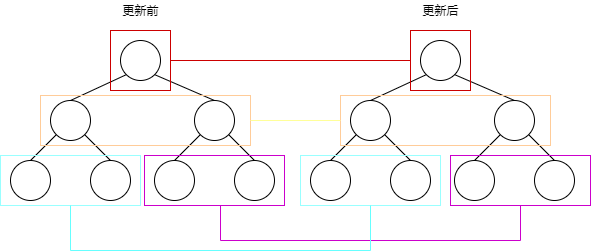
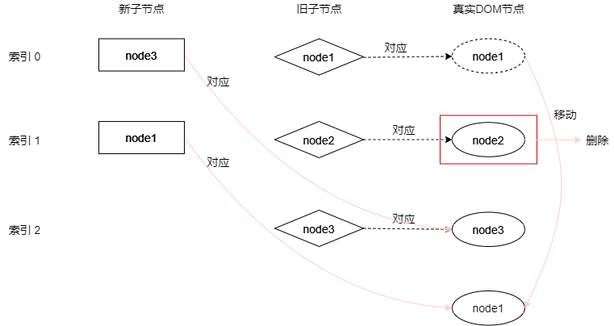

## Vue的虚拟DOM以及Diff算法

## 背景

从框架设计范式的角度来说，存在命令式和声明式两种范式，命令式更关注过程，比如早些年间流行的`jQuery`框架，比如把如下步骤翻译成代码

1、获取一个id为container的div标签

2、将这个div标签的文本内容设置为hello world

3、给这个div标签绑定一个点击事件，点击时console.log("hello world")

```js
// jQuery实现代码
$('#container')  // 获取div
  .text('hello world') // 设置文本
  .on('click', () => { console.log("hello world") }) // 绑定事件
```

而声明式更关注结果，比如`Vue.js`，实现上述代码的功能如下

```html
// Vue实现代码
<div @click="() => console.log('hello world')">hello world</div>
```

`Vue`的内部实现肯定还是命令式的，但是这一过程已经完全封装好了，用户使用则只需要使用声明式，可以看出声明式代码更精炼，也更好维护，减少心智负担

如果上面的div标签需要修改文本为hello kitty，只需要执行更新命令即可:

```js
div.textContent = 'hello kitty'
```

命令式的范式可以直接执行上面的代码即可修改，但是声明式范式则需要先去找到前后变化差异的地方，再执行上述代码，所以可以得出公式

命令式代码更新性能 = 直接修改的性能

声明式代码更新性能 = 找出变化差异的性能 + 直接修改的性能

因为`Vue`框架本身就是封装了命令式的代码才能面向用户实现声明式，所以声明式代码的性能不优于命令式代码的性能，如果把找出变化差异的性能尽可能地减少，就能在可维护性和性能之间找到一个权衡，在保持可维护性的同时性能损失最小化，于是虚拟DOM以及Diff算法应运而生

## 虚拟DOM

虚拟DOM其实就是一个js对象，这个对象描述了整个真实DOM树，将真实DOM抽象成了一个对象，便可用于后面的Diff算法中进行计算，虚拟DOM节点可以类似下面结构

```js
// 旧vnode
const oldVnode = {
    type: 'div',
    children: [
        { type: 'p', children: 'text1', key: 1 },
        { type: 'p', children: 'text2', key: 2 },
        { type: 'p', children: 'text3', key: 3 },
    ]
}
// 新vnode
const newVnode = {
    type: 'div',
    children: [
        { type: 'p', children: 'text3', key: 3 },
        { type: 'p', children: 'text1', key: 1 },
        { type: 'p', children: 'text2', key: 2 },
    ]
}
```

如果不采用虚拟DOM，从旧节点变成新节点，需要把原来的3个子节点删除，在渲染新的3个节点，需要6次操作；通过观察可以发现，子节点都是p标签，只是内容不同，所以只需要修改3次内容即可，需要3次操作，前后性能提升一倍！再仔细观察，p节点，text1节点，text2节点，text3都是可以复用的，key值就是新旧节点完全一致的唯一标识，新旧节点完全一致，则只需要进行移动操作，这样不需要渲染，性能再次得到提升

## Diff算法

diff算法会深度遍历新旧DOM树，找出其中差异的部分，进行更新操作，如图只会在同级进行比较，即图中颜色相同的节点部分



#### 如何移动可复用的节点


1、`lastIndex`变量初始值为0，代表上一次比较时的可复用节点在旧子节点中的索引值，遍历新子节点，取第一个`node3`索引为0，遍历旧子节点中`node3`索引为2，2不小于0，所以`node3`对应的真实DOM不需要移动，`lastIndex`修改为2

2、取新子节点第二个`node1`，索引为1，遍历旧子节点中对应索引为0，0小于2，所以需要移动，移动到哪里呢？其实最后新子节点的索引就是最终真实DOM要展示的位置，所以旧子节点中的`node1`应该移动到`node3`后面，`lastIndex`不变

3、取新子节点第三个`node2`，索引为2，遍历旧子节点中对应索引为1，1小于2，与第二步同理把`node2`移动到`node1`后面，最后完成更新

#### 如何新增子节点


1、`lastIndex`变量初始值为0，代表上一次比较时的可复用节点在旧子节点中的索引值，遍历新子节点，取第一个`node3`索引为0，遍历旧子节点中`node3`索引为2，2不小于0，所以`node3`对应的真实DOM不需要移动，`lastIndex`修改为2

2、取新子节点第二个`node1`，索引为1，遍历旧子节点中对应索引为0，0小于2，所以需要移动旧子节点中的`node1`移动到`node3`后面，`lastIndex`不变

3、取新子节点第三个`node4`，索引为2，遍历旧子节点中找不到可复用的子节点，所以需要挂载一个新的`node4`，挂载到哪里呢？因为在新子节点中`node4`在`node1`后面，所以真实DOM中也要挂载在`node1`后面即可

4、取新子节点第四个`node2`，索引为3，遍历旧子节点中对应索引为1，1小于2，移动`node2`到`node4`后面，最后完成更新

#### 如何删除不存在的节点



1、`lastIndex`变量初始值为0，代表上一次比较时的可复用节点在旧子节点中的索引值，遍历新子节点，取第一个`node3`索引为0，遍历旧子节点中`node3`索引为2，2不小于0，所以`node3`对应的真实DOM不需要移动，`lastIndex`修改为2

2、取新子节点第二个`node1`，索引为1，遍历旧子节点中对应索引为0，0小于2，所以需要移动旧子节点中的`node1`移动到`node3`后面，`lastIndex`不变

3、遍历一遍旧子节点，看在新子节点中查询是否有相同key值的节点，没有的则代表需要卸载该节点，最后完成更新

## Diff算法的应用

在`Vue2`中在上面`Diff`算法的基础上采用了双端进行比较计算的方式，在性能上比上述过程还得到了优化，而在`Vue3`中新增了预处理，而不是直接上`Diff`算法，并对整个模板文件的动态和静态进行了分析，在性能上得到了更多的提升，从而在保证维护性的同时，减少了性能的损失

## 总结

使用声明式的框架范式，需要封装命令式过程，这个过程一定伴随着性能的损失，但是可以大大减少心智负担，便于维护，而虚拟DOM的产生和使用，就是在这两者直接找到一个平衡点，虚拟DOM的`Diff`算法一步一步的迭代和完善，也在很大程度上减少了性能的开销，从而使得DOM的更新性能更加接近命令式更新

> 框架设计里导出都体现了权衡的艺术

建议在开发过程中对节点的DOM的key值保持唯一且不变性，能使得`Diff`算法的性能作用得到有效发挥