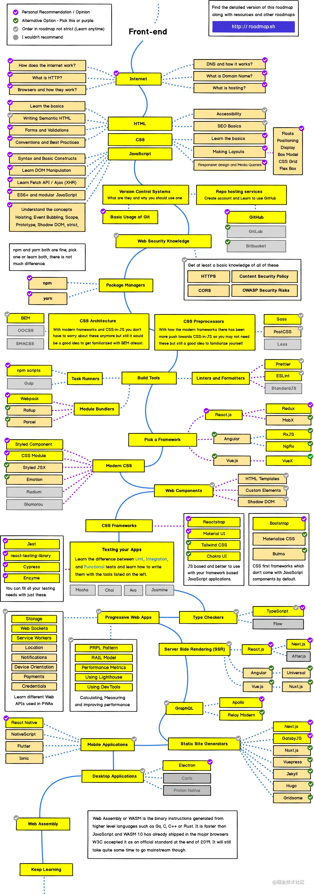

## 我的自学前端路线
## 写在前头
- 我在大学里学的是嵌入式，但是对于底层的数字逻辑，计算机组成原理学习得很差，我总感觉串不成线，很架空。不过本科学过的数据结构，计算机网络基础，web前端开发三剑客html,css,javascript还是给我创造了很好的前端学习基础。于是在2020年疫情期间，我在大三没去实习，没去秋招，只学前端相关知识，准备春招去找工作。
- 说实话但是的压力还是很大的，我不知道我这样的决定会不会影响到我的工作面试，我的这个决定是对是错，我也完全没把握，但是我还是按照自己的节奏一步一步地去学习前端开发，最终在2021年春招的时候，顺利面试，找到工作，虽然工作辛苦，和想象的生活差了很多，但是这个过程给我带来的了价值感，我的所有付出得到了回报，起码完成了目标。
- 这篇文章就我自己回头看看我是怎么一步一步学习的前端开发，并做一点点总结。
## 阅读书籍
- 我自己的习惯是遇到不会的知识点或者问题，我会想在第一时间去书里找寻答案，书籍已经是前人总结过的经验写出来了，非常系统，而且看书可以是在任何闲暇的时间，自己还可以在书上做笔记，印象会非常深刻。
### 前端的学习可以看看下面这些书

- 《从0到1html+css快速上手》、《从0到1html+css进阶》这两本书可以快速上手html和css，非常适合新手，里面包含了很多基本的常用的标签和属性，如果遇到陌生的，查一下也能找到，[链接](https://detail.tmall.com/item.htm?spm=a220m.1000858.1000725.21.5d063d7d6sZaWp&id=611170446835&areaId=510100&user_id=2541072356&cat_id=2&is_b=1&rn=317d0d854de132533332def92fa50aec)

- 《javascript高级程序设计》这本书涵盖了javascipt语言所有的知识点，学起来会非常全面和系统，[链接](https://detail.tmall.com/item.htm?spm=a220m.1000858.0.0.1b5d46e2oHcDcc&id=520830234267&areaId=510100&is_b=1&cat_id=2&q=%25B8%25DF%25BC%25B6+%25B3%25CC%25D0%25F2+%25C9%25E8%25BC%25C6)

- 《编码》这本书非常适合新手入门去了解计算机的组成原理知识，只要你是对计算机感兴趣，或者你想要了解底层计算机的实现，这本书都非常合适，作者从摩尔斯编码开始，内容循序渐进，很容易理解和掌握，比较容易读的进去，[链接](https://detail.tmall.com/item.htm?spm=a220m.1000858.1000725.6.44454c35HYoQFa&id=646660999739&areaId=510100&user_id=1020536390&cat_id=2&is_b=1&rn=8df08e4f5d678163c8540bc8c0ca51e5)

- 《图解HTTP》、《图解TCP/IP》这两本书对于学习计算机网络知识是非常友好的，里面有很多插图，读起来不会太吃力，包括应用层http协议，传输层的tcp协议，网络层的ip协议都有很好的讲解，这些对于前端来说都是非常重要的知识，[链接](https://detail.tmall.com/item.htm?spm=a220m.1000858.1000725.6.4f0ac9b1pc3C9l&id=565082048387&areaId=510100&user_id=2145487409&cat_id=2&is_b=1&rn=f36a82a44e06f1506a4a912998b23fd1)

- 《javascript数据结构和算法》这本书可以很好理解js的数据结构和算法，基本的冒泡排序等算法可以很好入门算法，数据结构是学计算机必学的课程，针对javascript的数据结构的学习，可以在实际开发中运用起来更得心应手，[链接](https://detail.tmall.com/item.htm?spm=a220m.1000858.1000725.11.583b7f4bz4Yeho&id=643023902284&areaId=510100&user_id=2211213114216&cat_id=2&is_b=1&rn=2a6b9e0794f8e04da6942a822e607e91)
## 其他知识
- 当然我在看上述的书籍的时候，我会去尝试开发一些简单的网站，自己去动手实践才是检验所学的重要途径。
- 还同时在闲余时间去学习了关于浏览器发展史，[浏览器运行原理](https://www.bilibili.com/video/BV1x54y1B7RE)，[互联网运作](https://www.bilibili.com/video/BV1Rz4y197Jd)，这些让我更好得理解浏览器的工作实现原理。
- 学习[vscode代码编辑器](https://code.visualstudio.com/)，我之前学习是用的[Hbuilder](https://www.dcloud.io/)，但是visual studio code更好用
- css框架[bootstrap](https://v3.bootcss.com/)，异步请求[axios](http://www.axios-js.com/)，代码管理器[git](https://git-scm.com/)，[node.js](https://nodejs.org/zh-cn/)，数据库[MongoDB](https://docs.mongodb.com/)，尝试用一些css框架让样式更好看，用node.js写个服务器操作数据库并抛出接口供前端调用数据，并使用git来管理自己的代码
- 主流前端框架[Vue.js](https://cn.vuejs.org/)，[React.js](https://react.docschina.org/)，css预处理器[scss](https://sass-lang.com/guide)、[less](https://less.bootcss.com/)等等
- 我前期学习的路线大致如上，然后把这些知识用在自己的项目开发过程中，熟悉他们。我会去B站看很多有关前端的视频，或者浏览很多前端有关的网页，只要遇到不会的知识点，或者不了解的专业名词，我都会记录下来，去查询资料查漏补缺，不断丰富自己的知识库。

## 题外话
这些学习思路和学习路线是我自己的一个过程，并不一定完全适合其他人。
- 网上有一个很火的前端学习路线图

- 这个基本上包括了整个前端学习的路线图，越前面的基础越重要，几乎所有知识都涵盖在其中了，我是拿这个来对比我所学，欠缺的我再继续弥补

- 在我看来，前端技术的学习一开始主要注重动手能力，一定要亲历亲为，亲自去实践并解决才能真正吸收到知识，然后再去阅读有关计算机的相关知识，比如数据结构，计算机网络基础，计算机组成原理，虽然这些和实际工作不会太沾边，但是这能给你完整的计算机思维和知识架构，懂得原理之后遇到问题才能从源头找到问题所在。然后在后续实际工作中，你要保持对新兴技术的好奇，不断地打磨自己的技术，不断丰富自己的所学。

一个B站up主在我困惑的时候这样跟我说过
> 掌握前端皮毛的人很容易被替代 
变化快是真的，所以要时刻保持不断学习 
变化快，也同样代表着机会 
你比其他人先了解掌握新技术 
那你就有竞争力

## 写在一块
- 总之，学习前端知识需要方方面面的知识，融合打通后才能为自己所用，保持好奇心，保持嗅觉，形成知识体系后(一定要在形成之后，不然会很凌乱)，再遇到知识盲区，可以马上去学习补上，这样就可以不断提升了。你至少还是得对前端有点兴趣的，不然这个过程是非常痛苦和煎熬的，只要愿意学，学习的资源是非常多的，并进入专业领域，找到价值感。:100: